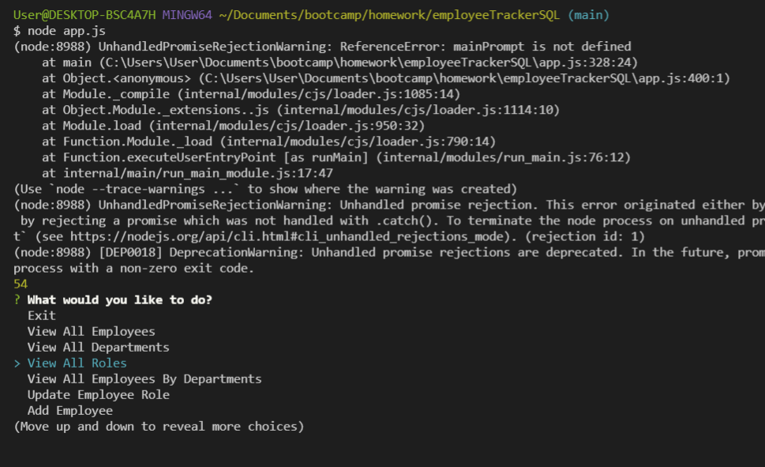

# employeeTrackerSQL

  
#Description

This application is used to manage a company's staff, and information about them. In the app you can add a new employee, a new role, or a new department. When inspecting an employee or role, you can see who the manager for that role is. 
    
# Table of Contents

* [Installation](#installation)
    
* [Usage](#usage)

* [License](#license)

* [Contributing](#contributing)

* [Tests](#tests)

* [Questions](#questions)

* [Video](#video)
    
# Installation
    The following necessary dependcies must be installed to run the application properly: inquierer, mysql and console-table.

# Usage

This is used as a database to manage a company's staff, with the app you can see the salary for each employee and add new employee's and roles.

# License

This application is covered by the MIT license.
    
# Contributing

Contributors: Samuel Montague

# Tests

To run tests, run the following command: node index.js
    
# Questions

If you have any questions about the repo, open an issue or contact me directly at SamuelpMontague@gmail.com. You can find more of my work at (https://github.com/SamuelMontague/).

# Video
https://drive.google.com/file/d/1H8m5XI7g0-I7YChf9tot9oKUVM2ky2EV/view